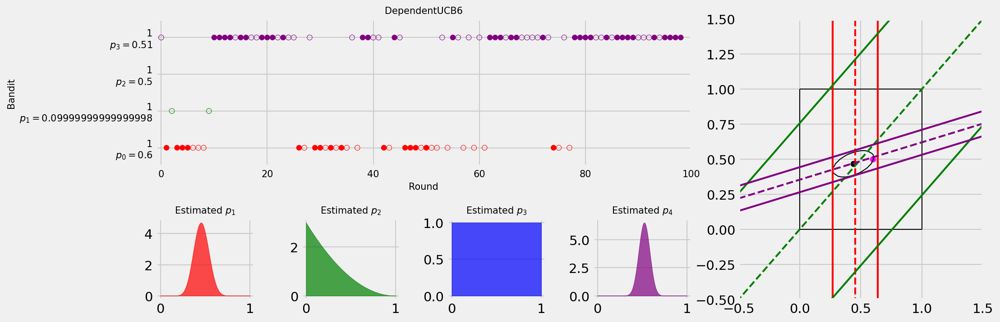
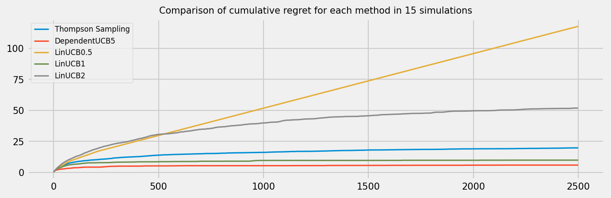

# Using Linear Programming to Solve Parametric Bernoulli Multi-Armed Bandit Problem

## Running code

In `main.py` there should be everything to run the tests you could want.

### Initialize bandit problem

You need to only change `bandit_matrix` and `values` in order to define a parametric bandit problem. The values represent the values for $\theta$ as you would expect. `bandit_matrix` is an np array of arrays. Each array represents one bandit, and its values the parameters of that banit. For instance:

```python
bandit_matrix = np.array([[1, 0], [1, -1], [0, 1], [-0.4, 1.5]])
values = [0.6, 0.5]
```

represents

$$
\begin{equation}
\begin{split}
    p_0 &= 1 \cdot \theta_0 + 0 \cdot \theta_1\\
    p_1 &= 1 \cdot \theta_0 - 1 \cdot \theta_1\\
    p_2 &= 0 \cdot \theta_0 + 1 \cdot \theta_1\\
    p_3 &= -0.4 \cdot \theta_0 + 1.5 \cdot \theta_1\\
    \theta &= \begin{pmatrix}
        0.6 & 0.5
    \end{pmatrix}
\end{split}
\end{equation}
$$

Note that the length of each array in `bandit_matrix` should be equal to the length of `bandit_probs`, i.e. the dimension of the value space.

The other examples from the paper are

```python
bandit_matrix = np.array(
    [
        [1.4, 0.2, -1, 0.6],
        [0.2, -0.5, 1.2, 0.2],
        [0.8, -0.1, 0, 1],
        [0.9, 0, 0, -0.5],
    ]
)
values = [0.3, 0.2, 0.3, 0.4]
```

for

$$
\begin{equation}
\begin{split}
    p_0 &= 1.4 \cdot \theta_0 + 0.2 \cdot \theta_1 - 1 \cdot \theta_2 + 0.6 \cdot \theta_3 \\
    p_1 &= 0.2 \cdot \theta_0 - 0.5 \cdot \theta_1 + 1.2 \cdot \theta_2 + 0.2 \cdot \theta_3 \\
    p_2 &= 0.8 \cdot \theta_0 - 0.1 \cdot \theta_1 + 0 \cdot \theta_2 + 1 \cdot \theta_3 \\
    p_3 &= 0.9 \cdot \theta_0 + 0 \cdot \theta_1 + 0 \cdot \theta_2 - 0.5 \cdot \theta_3\\
    \theta &= \begin{pmatrix}
        0.3 & 0.2 & 0.3 & 0.4
    \end{pmatrix}
\end{split}
\end{equation}
$$

```python
bandit_matrix = np.array(
    [
        [1, 1, 1, 0, 0],
        [1, 1, 0, 1, 0],
        [1, 1, 0, 0, 1],
        [1, 0, 1, 1, 0],
        [1, 0, 1, 0, 1],
        [1, 0, 0, 1, 1],
        [0, 1, 1, 1, 0],
        [0, 1, 1, 0, 1],
        [0, 1, 0, 1, 1],
        [0, 0, 1, 1, 1],
    ]
)
values = [0.3, 0.3, 0.15, 0.1, 0.05]
```

for

$$
\begin{equation}
\begin{split}
    p_0 &= 1 \cdot \theta_0 + 1 \cdot \theta_1 + 1 \cdot \theta_2 + 0 \cdot \theta_3 + 0 \cdot \theta_4 \\
    p_1 &= 1 \cdot \theta_0 + 1 \cdot \theta_1 + 0 \cdot \theta_2 + 1 \cdot \theta_3 + 0 \cdot \theta_4 \\
    p_2 &= 1 \cdot \theta_0 + 1 \cdot \theta_1 + 0 \cdot \theta_2 + 0 \cdot \theta_3 + 1 \cdot \theta_4  \\
    p_3 &= 1 \cdot \theta_0 + 0 \cdot \theta_1 + 1 \cdot \theta_2 + 1 \cdot \theta_3 + 0 \cdot \theta_4 \\
    p_4 &= 1 \cdot \theta_0 + 0 \cdot \theta_1 + 1 \cdot \theta_2 + 0 \cdot \theta_3 + 1 \cdot \theta_4  \\
    p_5 &= 1 \cdot \theta_0 + 0 \cdot \theta_1 + 0 \cdot \theta_2 + 1 \cdot \theta_3 + 1 \cdot \theta_4 \\
    p_6 &= 0 \cdot \theta_0 + 1 \cdot \theta_1 + 1 \cdot \theta_2 + 1 \cdot \theta_3 + 0 \cdot \theta_4 \\
    p_7 &= 0 \cdot \theta_0 + 1 \cdot \theta_1 + 1 \cdot \theta_2 + 0 \cdot \theta_3 + 1 \cdot \theta_4  \\
    p_8 &= 0 \cdot \theta_0 + 1 \cdot \theta_1 + 0 \cdot \theta_2 + 1 \cdot \theta_3 + 1 \cdot \theta_4 \\
    p_9 &= 0 \cdot \theta_0 + 0 \cdot \theta_1 + 1 \cdot \theta_2 + 1 \cdot \theta_3 + 1 \cdot \theta_4 \\
    \theta &= \begin{pmatrix}
        0.3 & 0.3 & 0.15 & 0.1 & 0.05
    \end{pmatrix}
\end{split}
\end{equation}
$$

### Plot

With `plot.plot_MAB_experiment` you can plot one run of a mab experiment as a video or frame like this:


```python
def plot_MAB_experiment(
    decision_policy,
    mab,
    N_DRAWS,
    bandit_probs,
    plot_title,
    graph=True,
    video=False,
    column_vecs=None,
    theta_values=None,
    alpha=None,
)
```

Arguments:

- `decision_policy(k_array, reward_array, n_bandits)` where `k_array` is a list of bandits where each bandit is a list of zeroes and ones whether that bandit was picked that round in the history, and `reward_array` is the same but the reward for that bandit in each round, and `n_bandits` is the number of bandits. It should return what bandit to play.
- `mab` the multi-armed bandit problem like `class MAB` in `main.py`.
- `N_DRAWS` the number of draws
- `plot_title` title
- `graph` whether to show the graph shown on the right side of the image.
- `video` whether to show a video where each round is a frame, or just output the last frame.
- `column_vecs` column vectors as for `LinUCB` in order to make the ellipsoid work for the graph
- `theta_values` the actual value for $\theta$ to be used for the graph.
- `alpha` the $\alpha$ for the ellipsoid from LinUCB in the graph.

### Simulation

Simulates some number of runs of multiple policies on a certain MAB, and outputs a plot of average cumulative regret like this:


```python
def simulation(
    mab,
    policies,
    n_rounds=1000,
    n_simulations=1000,
    plot_reward=False,
    uncertainty=None,
):
```

Arguments

- `mab` the multi-armed bandit problem like `class MAB` in `main.py`.
- `policies` a dictionary of policies to run on the bandit problem.
- `n_rounds` the number of rounds
- `n_simulations` the number of simulations with each `n_rounds` rounds.
- `plot_reward` whether to plot the cumulative reward as well as the cumulative regret.
- `uncertainty` if this is given it adds some uncertainty 'noise'. It adds to each bandit probability a certain error which is drawn from a uniform distribution between -uncertainty and +uncertainty. These errors are added at the start and then all policies are run on the same probabilities for all simulations.

### Policies

- TSPolicy - Thompson Sampling
- eGreedyPolicy - epsilon greedy
- RandomPolicy
- UCBPolicy. UCB1 from Auer2002 "Finite-time Analysis of the Multiarmed Bandit Problem"
- UCBPolicy2. UCB2 from the same paper.
- UCBPolicyTuned. UCB1-Tuned from the same paper. You need to provide the arguments `variables` and `bandit_expressions` made from the package `cvxpy`, `main.py` handles this. This is the same for the other dependent policies.
- UCBPolicyB. Variant that rounds to 3 decimals and picks random on tie
- UCBPolicyC. Additionally to UCBPolicyB also initially max probability upper bounds at 1.
- UCBDependent. Dependent version of UCB1.
- UCBDependentB. Dependent version of UCBPolicyB.
- UCBPolicy2Dependent. Dependent version of UCB2.
- UCBPolicyTunedDependent. Dependent version of UCB1-Tuned.
- LinUCB. LinUCB from the paper. Arguments are $\alpha$ and feature vectors, which crucially need to be np _column_ vectors. This is handled in `main.py`.
- eGreedyPolicyDecaying. Epsilon greedy but instead of epsilon, you provide epsilon function, which for every round has to give a certain epsilon. `lin_decaying(start,end,steps)` in `main.py` provides such a function that starts epsilon at `start`, and moves towards `end` in `steps` steps.
- eGreedyPolicyDecayingUCBTunedDependent. The same as eGreedyPolicyDecaying except that if the policy does not explore but rather exploit, it uses the UCBTunedDependent poliicy for this.
- DerivativeExplore. Same as eGreedyPolicyDecayingUCBTunedDependent except that when the policy explores it uses the derivatives of the linear program to determine which arm would be most effective to draw in order to gain the most information about the system.
